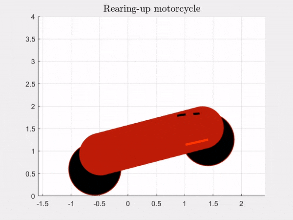

# Robot-Control

### Rearing-up motorcycle
- Observability analysis
- Parametric observability
- Development of Computed Torque controller , Computed torque controller and EKF and Li-Slotine controller

### UAV with arm
- Feedback linearization
- Comparison feedback linearization and approximated linearization
- Trajectory tracking
